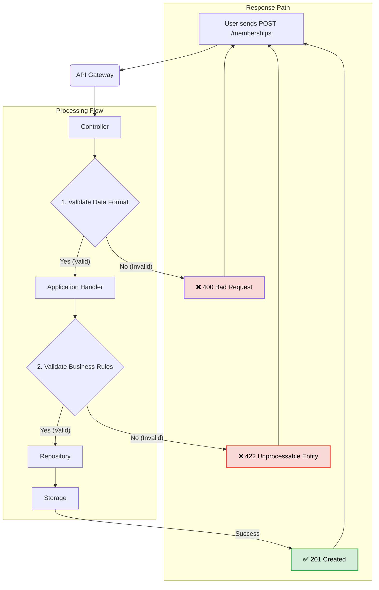

## Eversports Challenge: Modernizing the Membership Creation Endpoint


### The Problem: A Legacy "Fat Controller" Implementation

The legacy route for membership creation is implemented using a Transaction Script pattern, commonly known as a "Fat Controller," where all logic for a single operation is contained within a single procedure. This architectural approach presents several significant challenges that impede maintainability, testability, and scalability.
* **Violation of Separation of Concerns (SoC)**: The primary issue is the conflation of multiple distinct responsibilities. The controller simultaneously handles HTTP request parsing, input format validation, complex business rule enforcement, and data persistence logic. A controller's core responsibility should be to act as a thin layer that orchestrates the flow between the web interface and the underlying business logic, not to contain the logic itself.
* **Poor Testability**: Because the business logic is intrinsically coupled to the web framework's request and response objects, it cannot be unit-tested in isolation. This forces reliance on brittle and complex integration tests rather than fast and focused unit tests.
* **High Coupling and Low Cohesion**: This pattern results in high coupling, where the core business rules are not independent of the delivery mechanism (HTTP). This makes it difficult to reuse the logic in other contexts (e.g., a command-line interface or a background job).
* **Reduced Maintainability and Increased Risk**: The tight coupling means that any change is inherently risky. Modifying a single business rule could have unintended consequences on input validation or the final HTTP response, making the codebase fragile and difficult to evolve safely.


### The Solution: Adopting Domain-Driven Design (DDD)

To address these challenges, the proposed solution involves refactoring the architecture using the principles of Domain-Driven Design (DDD). DDD is an object-oriented architectural approach that emphasizes a deep understanding of the business domain, modeling it explicitly in the code.
This methodology directly resolves the issues of the Transaction Script pattern by establishing a layered architecture with a clear separation of concerns, providing several critical advantages:
* **Clear Boundaries and High Cohesion**: DDD enforces a separation between the interface (controllers), application (use cases), and domain (core business logic) layers. This ensures that each component has a single, well-defined responsibility.
* **Enhanced Testability**: The core business logic is encapsulated within a pure, framework-agnostic domain model. This allows for comprehensive and isolated unit testing of business rules.
* **Improved Maintainability and Scalability**: By isolating business logic, the system becomes far less fragile. The modular structure makes the application easier to understand, modify, and extend over time, adhering to the Don't Repeat Yourself (DRY) principle.
Ultimately, adopting DDD will transform the codebase from a fragile script into a robust, scalable, and business-centric application that is built for long-term evolution.


### An Alternative Approach: The Simple Service Layer

An alternative, more pragmatic solution is the Simple Service Layer pattern. This approach provides an immediate improvement over the Fat Controller by extracting all business logic and data access into a dedicated MembershipService class. The controller's role is reduced to receiving the request, calling the appropriate method on the service (e.g., membershipService.create(...)), and returning the response.
While this pattern effectively separates concerns from the controller, it is less structured than DDD and does not enforce a rich domain model. The service class itself can become a large, procedural script that handles many different responsibilities, risking the "God Object" anti-pattern over time.

### Comparative Analysis: DDD vs. Simple Service Layer

| Aspect                      | Simple Service Layer                                                                 | Domain-Driven Design (DDD)                                                               |
| --------------------------- | ------------------------------------------------------------------------------------ | ---------------------------------------------------------------------------------------- |
| **Complexity & Learning Curve** | **Low.** Easy to implement and understand.                                           | **High.** Requires understanding concepts like Aggregates, VOs, and Repositories.      |
| **Initial Development Speed** | **Fast.** Less boilerplate and upfront design needed.                                | **Slow.** Requires more ceremony and a deeper analysis of the domain.                    |
| **Long-Term Maintainability** | **Medium.** Can degrade into a complex "God Object" as features are added.           | **High.** Boundaries and patterns explicitly manage and contain complexity.            |
| **Best For** | Simple CRUD applications, prototypes, and domains with straightforward business logic. | Applications with complex, nuanced business rules that are core to the system's value. |

## Justification for Choosing DDD

While a Simple Service Layer would be a significant step forward, Domain-Driven Design is the recommended approach for this specific challenge for the following strategic reasons:
1. **The Inherent Complexity of the Domain:** The existing logic, though contained in one file, already demonstrates a non-trivial level of complexity. Rules regarding billing intervals, payment methods, and pricing are not simple CRUD operations. DDD provides the necessary tools (like Value Objects for Billing and Aggregates for Membership) to model these rules explicitly and robustly, preventing the logic from becoming an unmanageable script.
2. **Long-Term Vision and Scalability**: A feature like memberships is central to the business and is likely to evolve. Future requirements might include upgrades, downgrades, custom billing cycles, or promotions. DDD establishes a clean, scalable foundation that can accommodate such changes without requiring a complete rewrite. The clear separation of concerns ensures that adding new features is a structured and low-risk process.
3. **Guaranteed Consistency and Reliability**: By using an Aggregate Root (Membership), we create a transactional boundary that guarantees a membership is always in a valid and consistent state. This is critical for a core business function and provides a level of reliability that a procedural service layer cannot enforce as strictly.
In conclusion, the decision to use DDD is a strategic investment in the application's future. It provides the architectural rigor needed to manage the domain's complexity, ensuring the system remains maintainable, testable, and aligned with business goals as it grows.


## System Components



## Getting Started

### Prerequisites

Before running this application, ensure you have the following installed on your system:

- **Node.js** (version 16.x or higher)
- **Yarn** (comes with Node.js) 
- **TypeScript** (will be installed as a dependency)

### Installation

1. **Clone the repository** (if not already done):
   ```bash
   git clone https://github.com/Ltmodz95/Evesports-Challenge
   cd fullstack-interview
   ```

2. **Install dependencies**:
   ```bash
   yarn install
   ```


### Running the Server

1. **Start the development server**:
   ```bash
   yarn start
   ```
   
   The server will start on `http://localhost:3099` by default.

2. **Verify the server is running**:
   ```bash
   curl http://localhost:3099/memberships
   ```
   
   You should receive a JSON response with existing memberships.

### Running Tests

To run the test suite:

```bash
yarn test
```


### Project Structure

```
src/
├── modern/                    # Modern DDD implementation
│   ├── domain/               # Domain layer (business logic)
│   │   └── membership/
│   │       ├── aggregates/   # Aggregate roots
│   │       ├── entities/     # Domain entities
│   │       ├── repos/        # Repository interfaces
│   │       ├── use-cases/    # Application use cases
│   │       └── value-objects/# Value objects
│   ├── infra/               # Infrastructure layer
│   │   └── *.repository.ts   # Repository implementations
│   └── routes/              # API routes
├── legacy/                  # Legacy implementation
└── data/                    # JSON data files
```

## API Endpoints

The modernized membership system provides two main endpoints for managing memberships:

### 1. Create Membership
**POST** `/memberships`

Creates a new membership and automatically generates billing periods based on the specified billing interval and number of periods.

#### Request Body
```json
{
  "name": "Premium Plan",
  "recurringPrice": 99.99,
  "paymentMethod": "credit_card",
  "validFrom": "2025-01-01T00:00:00.000Z",
  "billingInterval": "monthly",
  "billingPeriods": 6
}
```

#### Request Body Schema
| Field | Type | Required | Description | Constraints |
|-------|------|----------|-------------|-------------|
| `name` | string | ✅ | Membership plan name | Must not be empty |
| `recurringPrice` | number | ✅ | Monthly/yearly recurring price | Must be > 0 |
| `paymentMethod` | string | ✅ | Payment method | `"credit_card"` or `"cash"` |
| `validFrom` | string (ISO 8601) | ✅ | Membership start date | Valid date string |
| `billingInterval` | string | ✅ | Billing frequency | `"weekly"`, `"monthly"`, or `"yearly"` |
| `billingPeriods` | number | ✅ | Number of billing periods | Monthly: 6-12, Yearly: 3-10 |

#### Success Response (201 Created)
```json
{
  "membership": {
    "name": "Premium Plan",
    "recurringPrice": 99,
    "paymentMethod": "cash",
    "validFrom": "2025-01-01T00:00:00.000Z",
    "billingInterval": "monthly",
    "billingPeriods": 6,
  }
}
```

#### Error Responses
- **400 Bad Request**: Invalid request body or validation errors
  ```json
  {
    "message": "missingMandatoryFields"
  }
  ```
- **500 Internal Server Error**: Server-side errors
  ```json
  {
    "message": "Error message details"
  }
  ```

### 2. List Memberships
**GET** `/memberships`

Retrieves all memberships with their associated billing periods.

#### Request
No request body required.

#### Success Response (200 OK)
```json
[
  {
    "membership": {
      "uuid": "123e4567-e89b-12d3-a456-426614174000",
      "id": 1,
      "name": "Premium Plan",
      "recurringPrice": 99.99,
      "paymentMethod": "credit_card",
      "validFrom": "2025-01-01T00:00:00.000Z",
      "validUntil": "2025-07-01T00:00:00.000Z",
      "billingInterval": "monthly",
      "billingPeriods": 6,
      "userId": 2000,
      "state": "active"
    },
    "periods": [
      {
        "id": 0,
        "uuid": "456e7890-e89b-12d3-a456-426614174001",
        "membership": 1,
        "start": "2025-01-01T00:00:00.000Z",
        "end": "2025-02-01T00:00:00.000Z",
        "state": "issued"
      },
      {
        "id": 0,
        "uuid": "789e0123-e89b-12d3-a456-426614174002",
        "membership": 1,
        "start": "2025-02-01T00:00:00.000Z",
        "end": "2025-03-01T00:00:00.000Z",
        "state": "planned"
      }
    ]
  }
]
```

#### Error Responses
- **500 Internal Server Error**: Server-side errors
  ```json
  {
    "message": "Error message details"
  }
  ```


### Next steps:
1.  Adding a persistence layer as (SQL)
2. Using Zod for schema validation
3. Adding authentication and authorization
4. Users Role
5. Rest of the CRUD operations
6. API Keys for external communications

## Second Task: CSV exporter Design

Here is a simple graph on how the CSV exported system design would look like:
